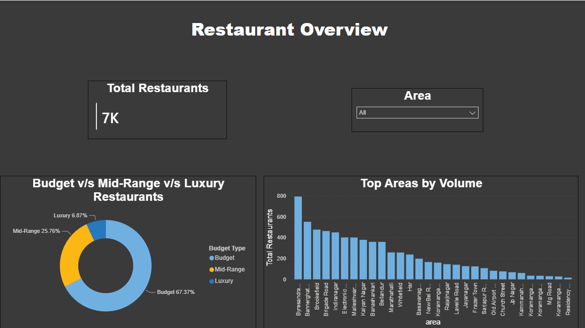

# Zomato Restaurant Market Analysis

**Author:** Anant Agarwal  
**Bootcamp:** BuildX Data Analytics End-to-End Project

## 📋 Project Overview
This project represents a complete data analytics workflow used to analyze the restaurant market in Bengaluru, India. The goal was to process raw data, extract business intelligence, and visualize consumer trends to help potential restaurateurs make data-driven investment decisions.

## 🛠️ Tools Used
* **Python (Pandas):** Data cleaning, handling missing values, text standardization, and feature engineering.
* **SQL (SQLite):** Relational database querying and business logic extraction.
* **Power BI:** DAX metric creation, data modeling, and interactive dashboard development.

## 📊 The Dataset
* **Source:** [Zomato Restaurants India (Kaggle)](https://www.kaggle.com/datasets/abhijitdahatonde/zomato-restaurants-dataset)
* **Why I Selected It:** I chose this dataset because the food and lifestyle industry offers highly relatable consumer data. It provided excellent opportunities to explore the correlation between pricing, geographic location, and customer satisfaction.

## ❓ Key Business Questions Answered
Using SQL, I extracted insights to answer several core business questions, including:
1. Which neighborhoods are the most competitive, housing over 50 restaurants?
2. What are the top 10 most expensive luxury restaurants for a dinner for two?
3. How many restaurants fall into each rating category, and what is the average cost within those tiers?

## 💡 Executive Insight
**Price vs. Performance:** High-volume user engagement (measured by the number of ratings) strongly correlates with restaurants sitting in the 'Good' and 'Very Good' rating tiers, whereas 'Poor' rated locations see negligible consumer reviews. Furthermore, areas showcasing premium average ratings do not always carry the highest average dining costs, spotlighting clear opportunities for high-margin, budget-friendly market entry.

## 📸 Dashboard Snapshots

![Power BI Dashboard)(dashboard_2.png)

---
